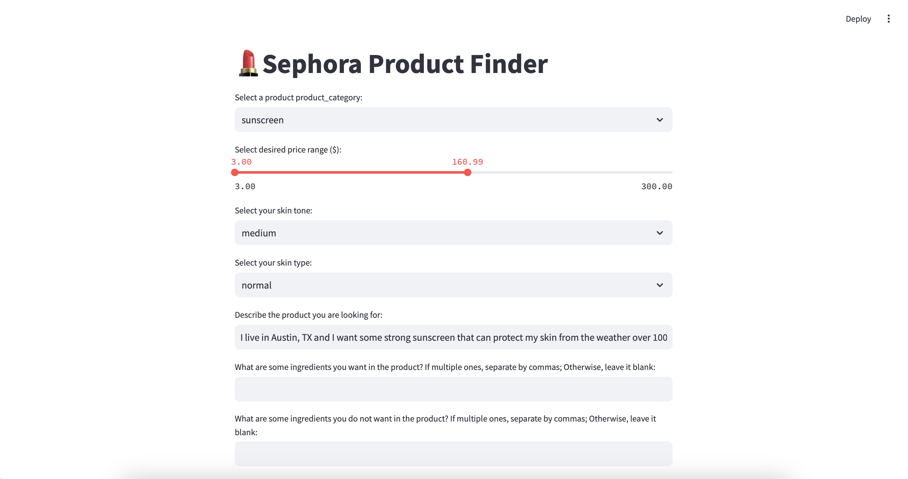
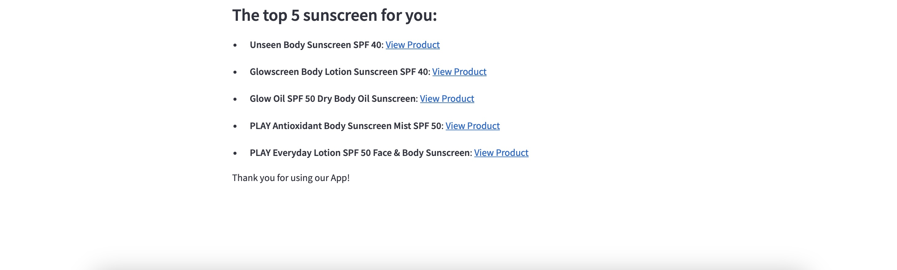

  # eco395m-final-project-recommendation-system
## Introduction
In today’s rapidly growing e-commerce landscape, selecting the ideal product from a vast array of options can be overwhelming for consumers. This project focuses on building a recommendation system tailored to Sephora's skincare and makeup products, leveraging data scraped from Sephora's API via Rapid API. By combining advanced data scraping techniques, sentiment analysis, and natural language processing (NLP), we aim to provide personalized recommendations that cater to individual user preferences and needs.

The system enables users to specify their desired product attributes, such as price range, category, skin type, and preferred ingredients. Using semantic similarity and weighted scoring mechanisms, our recommendation system ranks products that best match user inputs. The interactive dashboard further simplifies the selection process, offering a wonderful experience for users to find products suited to their requirements.

***Project Goals***
- **1. Efficient Data Collection and Processing:** Develop a robust pipeline for scraping and processing product data, including categories, product details, and customer reviews, to build a comprehensive dataset.
- **2. Personalized Product Recommendations:** Implement an intelligent recommendation system using machine learning and NLP to analyze user inputs and product reviews for semantic similarity and relevance.
- **3. User-Friendly Interface**: Design an interactive Streamlit dashboard that allows users to specify preferences and access ranked product recommendations with ease.
- **4. Enhance Decision-Making**: Provide users with meaningful insights through sentiment analysis, product attributes, and customer reviews to support informed decision-making.

A brief workflow of our pipeline is provided below:


## A. Data Scraping
***Source:***
We leverage the Sephora API via Rapid API (https://rapidapi.com/Octapi/api/sephora14) to scrape data on skincare and makeup products. The scraping process is broken into four sequential scripts, each targeting specific data points. All scraped data (`product_info`, `product_reviews`) is stored in a PostgreSQL database hosted on Google Cloud Platform (GCP), which ensures efficient storage and scalability. We use DBeaver as the database client to manage and query the data during the development and analysis phases.

### 1. **Get Category ID**

- Fetches all category IDs and labels from Sephora.
- Focuses on categories within the **skincare** and **makeup** sections.
- Selects categories that contain more products for deeper analysis.

### 2. **Retrieve Product Information**

- Searches for products using the selected category IDs.
- Collects product IDs and basic product information, such as:
  - brandName
  - displayName
  - heroImage,
  - **productId**
  - rating (The average of rating, from 1 to 5)
  - reviews (The number of reviews)

### 3. **Fetch Product Details**

- Uses the **product IDs** obtained in the previous step to gather detailed information about each product, such as:
  - longDescription
  - brandID
  - ingredientDesc
  - listPrice
  - quickLookDescription
  - lovesCount
  - fullSiteProductUrl

### 4. **Scrape Product Reviews**

- Retrieves customer reviews for each product by searching with the product IDs.
- Extracts data points including:
  - OriginalProductName
  - Rating
  - ReviewText
  - Title
  - Helpfulness
  - skinTone
  - eyeColor
  - skinType
  - hairColor

***Execution Method*** 

To execute the scraping code and get the data, you should first run the following codes from the terminal in order:
```bash
git clone git@github.com:TianyiZhang420/eco395m-final-project-recommendation-system.git
cd eco395m-final-project-recommendation-system
pip install -r requirements.txt
```
You should also get a Rapid API key, and set it in files in `code/scraping`. Then you can run the following codes to extract your own Sephora data:
```bash
python3 run code/scraping/1_get_category.py
python3 run code/scraping/2_get_productinfo.py
python3 run code/scraping/3_product_detail.py
python3 run code/scraping/4_review.py
```


## B. Data Overview

### Explorative Data Analysis(EDA)

This module provides visual and statistical insights into the dataset, focusing on product categories, ratings, reviews, and sentiment analysis. The EDA helps uncover patterns, relationships, and distributions in the data to better understand the dataset.

***Category Distribution***
<div align="center">

</div>

 - **Dominance of Facial Makeup and Skincare**: Foundation makeup and mascara categories dominate in terms of product availability, indicating higher market focus.
 - **Limited Representation of Certain Categories**: Blush and sunscreen have significantly fewer products, which may indicate gaps in these markets.
 - **Even Distribution in Some Areas**: Certain categories, like luminizers and face masks, show a balanced presence.


***Correlation Analysis of ratings and the number of reviews***

<div align="center">

</div>

- **Correlation Coefficient**: The coefficient is -0.02, indicating a near-zero and slightly negative relationship. This suggests that ratings and the number of reviews are almost independent of each other.
- **Outliers**: Some products with mid-range ratings (e.g., ~4.0) have an exceptionally high number of reviews (>20,000), which may influence the overall distribution.


***Rating Distribution***


<div align="center">

</div>

- **Dominance of Highly Rated Products**: The majority of products are rated between 4–5, with over 600 products falling into this category, highlighting a trend of high customer satisfaction.
- **Moderately Rated Products**: A smaller but notable portion of products has ratings in the 3–4 range, indicating decent but less impressive customer satisfaction.
- **Scarcity of Low Ratings**: Very few products fall in the 2–3 and 1–2 ranges, showing a rare occurrence of dissatisfaction.oducts with ratings in the ranges 2–3 and 1–2 are extremely few, indicating that most products are rated relatively highly.

***Sentiment Analysis***

<div align="center">

</div>

- **Overwhelmingly Positive Sentiment**: Most reviews (88.2%) are positive, reflecting strong approval and satisfaction from users.
- **Moderate Negative Sentiment**: A smaller percentage of reviews (9.8%) are negative, indicating there are only few dissatisfaction among users.
- **Low Neutral Sentiment**: Only 2% of reviews are neutral, suggesting an indifferent or average user experience.

## C. Recommendation System
### Filtering:
After accessing our PostgreSQL database, we develop a module that filters products based on user inputs for category and price range by executing SQL queries on our `product_info` database, performing an inner join with the `product_reviews` database on `productid`. This process generates an initial dataframe that includes product information along with each product's corresponding reviews and the reviewers' information. 

Because users may also specify wanted ingredients and unwanteded ingredients, we filter products that include the wanted ingredients and exclude the unwanted ingredients. 

To make the following score computation process more efficient, we select the reviews based on the user's input for skin type and skin tone. If a product has reviewers whose skin type and skin tone match the user's inputs, only those matching reviews are retained in the dataframe. If no such matches are found, all reviews for that product are kept as data for further analysis. 

Through the above steps, we obtain a cleaned dataframe that serves as the input data for the next stage of analysis.

### Modeling:
Here, we utilizes natural language processing (NLP) techniques and machine learning models to compute semantic similarities between user descriptions and product reviews, while also considering product ratings to enhance recommendations.

***1. Semantic Matching:***
#### Usage:
  - Input Requirements:
    1. User Description (`user_des`): A string describing the product the user is looking for.
    2. Product Information (`product_info`): A pandas DataFrame with product information.
  - Output:
    1. Ranked Product Dataframe (`ranked_df`): A DataFrame with the ranked product recommendations.

**Model Used:** The system uses the `all-MiniLM-L6-v2` model from the `SentenceTransformer` library, a lightweight pre-trained model optimized for semantic tasks.

**Process:** The user's input is converted into a semantic vector. Each product review is similarly transformed into a semantic vector. The similarity between the user input vector and each product review vector is calculated using cosine similarity. Higher similarity scores indicate a closer match between the user's needs and the product reviews.

***2. Weighted Scoring:***
  
  The recommendation system combines semantic similarity and product ratings to calculate a final score for each product. This score is used to rank products and generate a prioritized list of recommendations.

**Scoring Logic:** The recommendation score is calculated using the formula:

$$ \text{Score} = w_1 \cdot (\text{Similarity Score})^\beta + w_2 \cdot (\text{Rating})^\alpha$$

  where:

  - Rating: Normalized product rating (scaled to a 0–1 range).
  - Weights ($w_1, w_2$): Control the importance of similarity and rating in the final score.
  - Exponents ($\alpha, \beta$): Penalize lower similarity scores or ratings more heavily, emphasizing higher values.

**Default Parameters:**
  - $w_1 = 0.7, w_2 = 0.3$: Prioritizes semantic similarity over product ratings.
  - $\alpha = 0.8, \beta = 0.8$: Adjust the influence of ratings and similarity scores.

***3. Ranked Output:***

Provides a sorted list of product recommendations with detailed information.The system computes a final score for each product based on semantic similarity and rating. Products are sorted in descending order by their scores. A ranked DataFrame is created, starting with the highest-ranked product.

### User Interface:
Our recommendation system results in an interactive dashboard in Python using Streamlit for users to select with their preference and get the best fit product from our recommendation system. Make sure you upload your data to Google Cloud Platform with the instance started and have your database credentials in the hidden .env file. Everything is being connected through the [dashboard.py](code/recommendation_system/dashboard.py) file by local modules and there is nothing else you need to run separately for queries or models. To open up the Streamlit dashboard, run the following command from the root:
```bash
streamlit run code/recommendation_system/dashboard.py 
```
Some dashboard highlights are as follows:

1. Users can select a product category, specify a desired price range, choose a skin tone and skin type, and provide a short description of their desired product. They may also optionally input wanted and unwanted ingredients.
2. All filters must be completed for users to proceed to the recommendation step. If any required filter is missing, a warning message will be displayed.
3. Based on the user's selections, SQL queries will be executed to search the database for products that meet all the specified criteria. If no matching products are found, users will be prompted to modify their selections.
4. If products meeting the initial requirements are found, their details, along with the user's description, will be sent to our embedding model for further recommendations. 
5. The dashboard will display the top 5 recommended products, including their names and clickable links that direct users to the corresponding product pages on Sephora.

The pictures below demonstrate an example of selecting sunscreens using our dashboard, along with the display of the recommended results:



## D. Limitations

* Our system relies on static data stored in the PostgreSQL database hosted on Google Cloud Platform (GCP). Any updates to product information, reviews, or categories require manual re-scraping and database updates.
* We currently focus on a subset of categories within skincare and makeup, prioritizing those with a higher number of products. However, this approach excludes less populated categories that might still be of interest to users.
* Our recommendation system does not take the official product descriptions into account, which may contain information about the product's features and uses. 
* Our dashboard only displays selected product names and links to the websites, which might not be visually engaging from an UI/UX perspective.

## E. Further Plans
* Integrate data automatically from Sephora’s API using script management tools to provide updated product details on a regular basis. 
* Include the official product descriptions in the analyzed data, generate embeddings, and calculate their similarity to the user's input as part of the recommendation score.
* Redesign output interface by adding elements including but not limited to images, ratings, or other visual cues.
